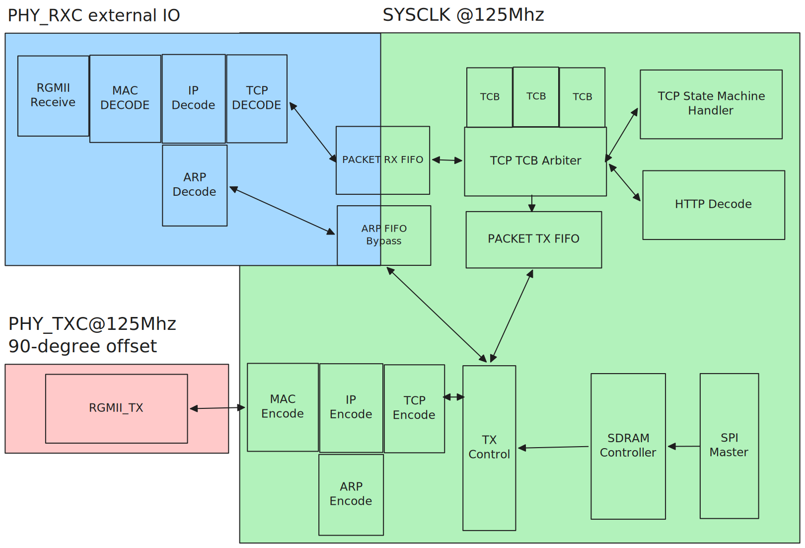

# FPGA Webserver

Goals: Use a cheap FPGA to support TCP, and then, use it to serve a blog.

## Design

### Assumptions

A set of simplifying assumptions to scope out the project.

HTTP
- HTTP1/2 protocol only.
- No TLS which means no HTTPS. This needs to be offered by a proxy.
- Headers entirely ignored.
- Only GET will be supported.

IP
- IPv4 only.
- Fragmentation unsupported.
- TCP only protocol support.

## Geting Started

Hardware: Colorlight 5A-75B Board

Get the tools: [OSS CAD Suite](https://github.com/yosyshq/oss-cad-suite-build)

Synthesize, route and flash to board:`make route && make flash`

### Testing

cocotb test framework is used to automate tests found in `tb/`.

Install dependencies: `pip install -r requirements.txt`

### Resources
- Board reverse engineering: https://github.com/q3k/chubby75
